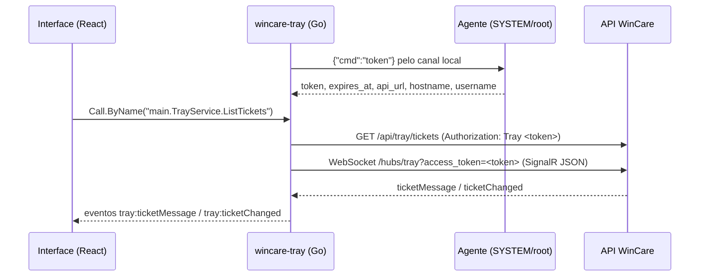

# wincare-tray

App de bandeja do usuário final do WinCare. Roda na sessão do usuário, abre chamados (com captura de tela), mostra a conversa com o técnico em tempo real e avisa por notificação do sistema.

Feito em Go com Wails v3 (`github.com/wailsapp/wails/v3` fixo em `v3.0.0-beta.26`, ADR-008) e React + TypeScript (Vite). É um módulo Go separado (`github.com/pauloacruz/rmmagentwincare/tray`); o agente na raiz do repositório não depende dele.

## Como funciona



* Todo acesso HTTP e SignalR fica no Go. O token nunca chega ao JavaScript e não há CORS.
* Canal local com o agente: Windows `\\.\pipe\wincare-tray`; Linux `/run/wincare-tray.sock`; macOS `/var/run/wincare-tray.sock`. O agente identifica o usuário pelo processo do outro lado do canal.
* O token é pedido na partida e renovado quando faltar menos de 1 hora para expirar ou quando a API responder 401 (a chamada é repetida uma vez com o token novo).
* Se o agente não responder, a interface mostra "Serviço WinCare indisponível" e tenta de novo a cada 30 s.
* Tempo real: cliente mínimo do protocolo JSON do SignalR sobre WebSocket direto (sem negociação), com ping a cada 15 s, resposta aos pings do servidor, reconexão com espera crescente de 1 s até 30 s e token renovado.
* Notificações: mensagem de técnico com a janela fora de foco e mudança de status do chamado (título "WinCare", texto com o número do chamado). Clicar na notificação abre o chamado.
* Bandeja: "Abrir WinCare", "Novo chamado" e "Sair". Clicar no ícone mostra a janela. Fechar a janela só esconde. Instância única: abrir de novo só traz a janela para a frente.
* Captura de tela: com "Anexar captura da tela" marcado, a janela some, o app espera 400 ms, captura o monitor principal em PNG (`github.com/kbinani/screenshot`) e mostra a janela de novo. Acima de 10 MB a imagem é convertida para JPEG.

## Estrutura

| Caminho | Conteúdo |
|---|---|
| `main.go` | Janela, bandeja, instância única, notificações |
| `service.go` | `TrayService`, o serviço chamado pela interface |
| `selfservice.go` | Métodos do autoatendimento e notificação ao fim da execução |
| `capture.go`, `notifier.go` | Captura de tela e notificações do sistema |
| `internal/ipc` | Cliente do canal local (um arquivo por sistema) e renovação do token |
| `internal/api` | Cliente HTTP das rotas `/api/tray/*` e tipos |
| `internal/realtime` | Cliente SignalR (protocolo JSON sobre WebSocket) |
| `frontend/` | Interface React + TypeScript (Vite) |
| `build/` | Ícones (`appicon.png`, `tray.png`) |
| `packaging/` | Exemplos para iniciar com a sessão em cada sistema |

### Métodos expostos à interface

Chamados por `Call.ByName("main.TrayService.<Método>")` de `@wailsio/runtime` (sem bindings gerados):

| Método | Retorno |
|---|---|
| `Session()` | `{ hostname, username, clientName, siteName, connected, realtime, error? }` |
| `ListTickets()` | `TrayTicket[]` |
| `GetTicket(id)` | `TrayTicket` com `description`, `messages` e `attachments` |
| `CreateTicket(title, description, includeScreenshot)` | `{ ticket, screenshotAttached, screenshotError? }` |
| `SendMessage(ticketId, body)` | `TrayMessage` |
| `Attachment(ticketId, attachmentId)` | data URL base64 da imagem |
| `CaptureScreenPreview()` | data URL da captura (opcional, a interface atual não usa) |
| `SelfServiceOptions()` | `{ enabled, tasks: [{ module, key, label, description }] }` |
| `RunSelfService(module, key)` | `{ runId }` (403 e 409 `AGENT_BUSY` viram mensagens amigáveis) |
| `SelfServiceRun(runId)` | `{ runId, status, progress, label, messages }` |

Eventos emitidos: `tray:ticketMessage` `{ ticketId, message }`, `tray:ticketChanged` (TrayTicket), `tray:connection` `{ realtime }`, `tray:navigate` `{ view, id }`, `tray:refresh`, `tray:selfService` `{ runId, status, progress, message }` (evento `selfServiceChanged` do hub).

### Resolver sozinho (autoatendimento)

A aba "Resolver sozinho" aparece quando o técnico libera o autoatendimento (`enabled`). O usuário escolhe uma ação, confirma e acompanha a barra de progresso e a última mensagem em tempo real (com consulta de segurança a cada 10 s enquanto a execução estiver em andamento). Ao terminar, o app mostra o resultado (Concluído, Concluído com avisos, Falhou, Cancelado, Tempo esgotado), envia uma notificação do sistema e, se a ação não resolveu, oferece "Abrir chamado" com título e descrição sugeridos.

## Requisitos

* Go 1.25 ou mais novo (exigência do Wails beta.26; com `GOTOOLCHAIN=auto` o Go baixa a versão certa sozinho).
* Node.js 20 ou mais novo e npm.
* Linux: `sudo apt-get install -y libgtk-3-dev libwebkit2gtk-4.1-dev` (e `build-essential`, `pkg-config`). O Wails beta.26 usa GTK 4 por padrão no Linux; este projeto compila com a tag `gtk3` para usar GTK 3 e WebKit2GTK 4.1. Para usar GTK 4, instale `libgtk-4-dev libwebkitgtk-6.0-dev` e compile sem a tag.
* Windows: WebView2 Runtime (já vem no Windows 11 e nas versões atuais do Windows 10).
* macOS: Xcode Command Line Tools.

## Como compilar

Sempre compile a interface antes, porque o Go embute `frontend/dist`:

```bash
cd tray/frontend
npm ci
npm run build
cd ..
```

Linux (CGO):

```bash
go build -tags gtk3 -o wincare-tray .
```

Windows (sem CGO, pode ser compilado a partir do Linux):

```bash
GOOS=windows GOARCH=amd64 go build -ldflags "-H=windowsgui" -o wincare-tray.exe .
```

macOS (no próprio Mac, CGO):

```bash
CGO_ENABLED=1 go build -o wincare-tray .
```

Para distribuir no macOS, empacote o binário em `WinCare.app` (com `LSUIElement` no `Info.plist`) e assine. O ícone do executável no Windows também não está embutido; use `go-winres` ou a CLI `wails3` se precisar.

## Testes e verificação

```bash
cd tray
go vet -tags gtk3 ./...
gofmt -l .
go test ./internal/...
cd frontend
npm run lint
npm run typecheck
npm test
```

Testes Go: cliente IPC com agente falso em socket Unix temporário (Linux), renovação do token perto da expiração, parser do protocolo SignalR (handshake, separador 0x1E, ping, invocation, close), cliente SignalR contra um hub falso e renovação do token quando a API responde 401.

### Desenvolvimento da interface sem o Go

`npm run dev:mock` abre o Vite com um backend simulado (dados fictícios e uma resposta automática de técnico 3 s depois de abrir um chamado).

## Variáveis de ambiente

| Variável | Uso |
|---|---|
| `WINCARE_TRAY_INSECURE=1` | **Somente para testes.** Desliga a validação do certificado TLS da API e do WebSocket (por exemplo, servidor de laboratório com certificado autoassinado). O app registra um aviso no log. Nunca use em produção. |

## Iniciar com a sessão do usuário

O argumento `--hidden` inicia o app só na bandeja, sem abrir a janela.

* **Windows**: valor `WinCareTray` na chave `HKLM\SOFTWARE\Microsoft\Windows\CurrentVersion\Run`. Veja `packaging/windows/wincare-tray-run.reg` ou `packaging/windows/install-run-key.ps1` (executar como administrador).
* **Linux**: copie `packaging/linux/wincare-tray.desktop` para `/etc/xdg/autostart/wincare-tray.desktop` e o binário para `/usr/bin/wincare-tray`. No GNOME, o ícone da bandeja precisa da extensão AppIndicator/KStatusNotifierItem.
* **macOS**: copie `packaging/macos/br.com.wincare.tray.plist` para `/Library/LaunchAgents/` (dono `root:wheel`, permissão 644). Ele é carregado em cada login gráfico.

## Limites conhecidos

* Linux sem `StatusNotifierWatcher` (por exemplo, GNOME sem extensão de AppIndicator) não mostra o ícone da bandeja; a janela continua funcionando. Como fechar só esconde, nesse caso use `wincare-tray` de novo (instância única) para trazer a janela de volta.
* Sem barramento D-Bus de sessão ou sem servidor de notificações, o app funciona sem notificações (registra no log).
* Captura de tela no Linux usa X11; em sessão Wayland pura ela falha e o chamado é aberto sem a captura, com aviso na tela.
* O agente reaproveita o token em cache enquanto faltar mais de 1 hora para expirar; se o servidor invalidar o token antes disso, o 401 persiste até o agente renovar.
* O indicador de mensagem nova é guardado no armazenamento local da janela (por máquina e usuário).
